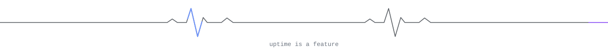

<p align="center">
  
</p>

<p align="center">
  <a href="https://portfolio-theta-lyart-35.vercel.app"></a>
  <a href="https://github.com/yashsrivastava1408?tab=repositories"></a>
  <a href="https://ops-academy-chi.vercel.app"></a>
</p>

<br/>

<table>
<tr>
<td width="58%" valign="top">

### `01` &nbsp;About

I build production-grade infrastructure and AI-integrated backends — the kind of systems that handle real load, fail gracefully, and are actually observable when they don't.

Day to day that means CI/CD automation, Kubernetes orchestration, GPU infrastructure (NVIDIA DGX) and distributed event pipelines on the **Sentrix AI Security Platform** at **TalenciaGlobal**.

</td>
<td width="42%" valign="top">

### `02` &nbsp;Now

```yaml
shipping: CI/CD automation, event pipelines
building: MirrorGuard (final-year major project)
hacking:  DEV Hacktoberfest 2026
studying: B.Tech CSE @ SRM IST, class of 2027
```

</td>
</tr>
</table>

<p align="center"></p>

### `03` &nbsp;Selected work

<table>
<tr>
<td width="50%" valign="top">

#### [MirrorGuard](https://github.com/yashsrivastava1408/Mirrorguard/tree/develop)
<sup>BENCHMARK &nbsp;·&nbsp; GUARDRAIL PROXY</sup>

Measures how much AI chatbots over-agree with psychologically vulnerable users, then sits in front of the model as a proxy that checks and rewrites risky replies. Multi-tenant, with an operator dashboard.

`Python` `LiteLLM` `Groq` `LangGraph` `PostgreSQL` `Redis` `Next.js` `k6`

</td>
<td width="50%" valign="top">

#### [OpsAcademy](https://github.com/yashsrivastava1408/OpsAcademy)
<sup>DEVOPS LABS &nbsp;·&nbsp; <a href="https://ops-academy-chi.vercel.app">LIVE</a></sup>

Browser-based DevOps learning platform. Learners run real Linux commands in isolated sandboxes, with step verification and an AI mentor grounded in the sandbox's files and command history.

`React` `Node.js` `Python` `Docker` `Prometheus` `Grafana` `Playwright`

</td>
</tr>
<tr>
<td width="50%" valign="top">

#### [Aether Clinic](https://github.com/yashsrivastava1408/Aether-Clinic)
<sup>HEALTHCARE &nbsp;·&nbsp; AGENTIC RAG</sup>

AI healthcare platform built on a LangGraph consult graph: hybrid retrieval over a medical corpus, specialist hand-off, a lab-report agent, patient memory, and optional clinician review before a reply goes out. In pilot with 10 MBBS students.

`React` `Node.js` `Python` `LangGraph` `Qdrant` `Docker`

</td>
<td width="50%" valign="top">

#### [DevSick](https://github.com/yashsrivastava1408/DevSick)
<sup>INCIDENT REASONING &nbsp;·&nbsp; RCA</sup>

AI reasoning engine for distributed failure analysis. Traverses a service dependency graph and generates confidence-scored RCA reports across 6 failure layers — so you know *why* something broke, not just that it did.

`FastAPI` `Llama 3.3` `Prometheus` `Grafana` `Docker` `Terraform` `AWS EC2`

</td>
</tr>
<tr>
<td width="50%" valign="top">

#### [Question Forge](https://github.com/yashsrivastava1408/QuestionForge)
<sup>ASSESSMENT &nbsp;·&nbsp; LLM PIPELINE</sup>

LLM question generator for placement and hiring tests. Every question passes a validation engine and an independent solver, and coding questions are run in a sandbox before they are accepted.

`TypeScript` `Turborepo` `Prisma` `PostgreSQL` `Redis` `Piston`

</td>
<td width="50%" valign="top">

#### [Lock Focus](https://github.com/yashsrivastava1408/lock-focus-hackathon)
<sup>HACKATHON WINNER &nbsp;·&nbsp; ON-DEVICE AI</sup>

Privacy-first adaptive reading platform with real-time gaze tracking and local AI inference under 10ms. All processing stays on-device — zero data leaves the browser.

`Python` `OpenCV` `Local AI` `Secure Backend`

</td>
</tr>
</table>

<details>
<summary><b>More projects</b></summary>
<br/>

| Project | What it is | Built with |
| :-- | :-- | :-- |
| [TrailHead](https://github.com/yashsrivastava1408/TrailHead) | Evidence-based placement guide for final-year students | `React` `Express` `LangGraph.js` `SQLite` |
| [CartPilot](https://github.com/yashsrivastava1408/cartpilot) | Splits one grocery list across stores for the lowest total | `FastAPI` `Chrome extension` `Playwright` |
| [ExamOracle](https://github.com/yashsrivastava1408/ExamOracle) | Turns lecture notes into probability-ranked exam predictions | `Next.js` `Prisma` `Gemini API` |
| [distributed-job-scheduler](https://github.com/yashsrivastava1408/distributed-job-scheduler) | Job scheduler with atomic queue claiming (`SKIP LOCKED`) | `TypeScript` `PostgreSQL` |

</details>

<p align="center"></p>

### `04` &nbsp;Stack

| | |
| :-- | :-- |
| **Languages** |      |
| **Backend** |     |
| **Frontend** |    |
| **Infra & DevOps** |         |
| **Cloud & Observability** |     |
| **AI / ML** |       |
| **Data** |      |

<p align="center"></p>

### `05` &nbsp;Open source

**[claude-deck #38](https://github.com/adrirubio/claude-deck/pull/38)** &nbsp;`merged`<br/>
Production Docker hardening, security improvements, and runtime stability fixes.

### `06` &nbsp;GitHub

<p align="center">
  
  
</p>

<p align="center">
  
</p>
